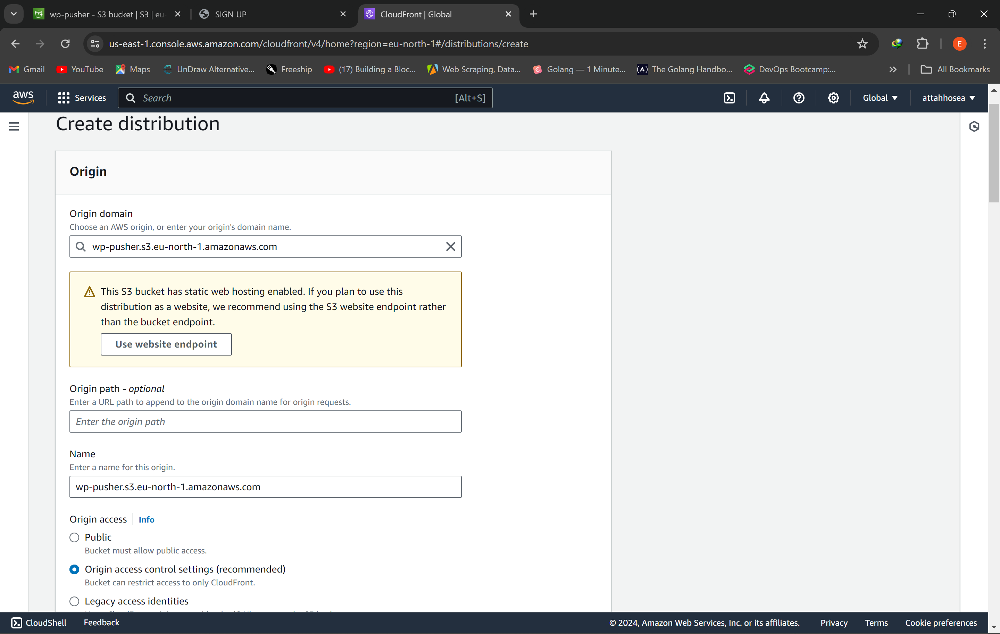

# HOSTING A STATIC WEBSITE ON AWS S3 AND USING CLOUDFRONT FOR CDN

## Task
Create a static website and host it on S3 bucket(private bucket) but with public read policy assigned, using cloud front for CDN

## Requirements

i. An AWS account
ii. Webpage or website files for hosting (HTML, CSS, JS, etc)

## Steps 

### - Create a Bucket on Amazon S3

i. After sign up and registration on AWS, Log into your AWS console and search for **S3** and click on it.

ii. Next, click on **create bucket**, go ahead to fill in a unique bucket name that has not been used, untick **Block all public access** and acknowledge the box below it.

 

iii. Leave all other settings unchecked and scroll down to click **create bucket**.


### - Upload Website files to S3 Bucket

i. Click on the bucket name you created.

ii. On the next screen, click on **upload** and select the files from your local computer. **NOTE:** Don't try to upload everything at once in a single folder. Instead, upload your files based on their type; if you have a folder containing images, a folder for css and an index.html file, upload the two folders first by clicking **upload folder** and selecting them, this will upload both files individually with their structures, then click **upload file** and select index.html.


iii. Click on **Add folders** or **Add file** and upload your folders and files.


iv. After uploading the folders from your computer, click on **Upload**. Wait for the process to complete with a success banner at the top.


### - Enable Static Website Hosting on S3 Bucket

i. After uploading, inside the S3 bucket click on the **Properties** tab and scroll down to **Static website hosting**


ii. Click **Edit** on **Static website hosting** and select **Enable**.


iii. Select **Host a static website** under **hosting type**. Under **Index document**, type "index.html" in it.


iv. Leave other settings as default and **save changes** at the bottom.


### - Attach a Bucket Policy

i. Click on **Permissions** tab, scroll down to **Bucket policy** and click on **Edit**

ii. Input the policy attached below. Scroll down and click on **save changes**. **NOTE:** Replace "wp-pusher" with your own bucket name.

```
{
    "Version": "2012-10-17",
    "Statement": [
        {
            "Sid": "PublicReadGetObject",
            "Effect": "Allow",
            "Principal": "*",
            "Action": "s3:GetObject",
            "Resource": "arn:aws:s3:::wp-pusher/*"
        }
    ]
}
```


iii. Click on the **Properties** tab and scroll down to **Static website hosting**, click on the link and your static website should upen in the next tab in your browser.


### - Create a CloudFront Distribution to make your AWS S3 bucket private

i.Search for **Cloudfront** in your AWS console and click on it.

ii. Click on **Create a CloudFront distribution**.


iii. Under **Origin domain**, select your S3 bucket. Do not click on **use website endpoint**.



iii. Click on **Create new OAC**


iv. Under **Web Application Firewall (WAF)**, click on **Do not enable security protections**.


v Leave everything as default and click **create distribution**


vii. Next, click on **copy policy**


viii. Go back to **permissions** under your S3 bucket and scroll to **bucket policy**, click **edit**. Clear the policy you inputted before. Paste the copied policy in there. Scroll down and click on **save changes**.


ix. Go back to your cloudfront distribution, copy the **Distribution domain name**, paste it in your browser and add /index.html to it.

 

x. Working static website.


## Conclusion

By following these steps, you've successfully created a static website hosted on a private S3 bucket with CloudFront acting as a Content Delivery Network (CDN). This configuration offers several advantages:

- Security: Your website's origin (S3 bucket) remains private, protecting your files from unauthorized access.
- Performance: CloudFront distributes your website content across a global network of edge locations, reducing latency and improving loading times for users worldwide.
- Scalability: CloudFront automatically scales to handle traffic spikes, ensuring your website remains accessible even during high demand periods.
- Cost-effectiveness: Since the S3 bucket is private, you only pay for storage and CloudFront charges for data transfer out.

This approach is ideal for static websites like portfolios, brochures, or landing pages. Remember to replace the placeholder values (like bucket name) with your specific details.